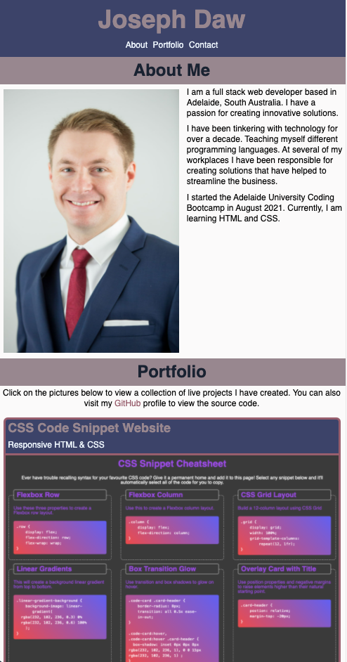

# My Portfolio Page

## Description
This website is a responsive HTML website using semantic tags and CSS. It was designed using a "mobile first" philosophy. I coded this website from scratch without using any frameworks.

This is the first version of my personal portfolio website which you can view on Github Pages at https://josephdaw.github.io/portfolio-one

If you would like to view my most recent portfolio page visit https://josephdaw.github.io.

## Lessons
As the focus of this site has been responsive design, I have used CSS flex-box extensively to acheive this objective. This project has been a good, and sometimes painful, lesson in how to display a site responsively. This is one of the first website I have designed from the ground up, certainly the first one that is responsive.

This project has really cemented why developer tools like Chrome DevTools is such a powerful and useful resource. Up until now I have played around with it, without fully appreciating just how much it can assist with finding out how to achieve the style you are trying to achieve.

## License
This project is released under the [MIT License](LICENSE).